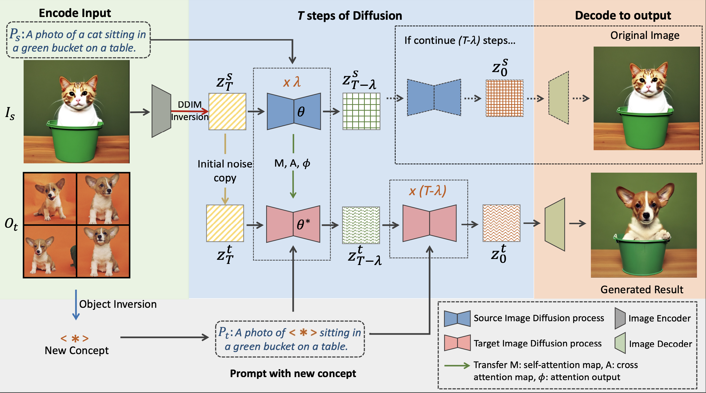

# PHOTOSWAP

[Jing Gu](https://g-jing.github.io/), [Yilin Wang](https://yilinwang.org/), [Nanxuan Zhao](http://nxzhao.com/), [Tsu-Jui Fu](https://tsujuifu.github.io/), [Wei Xiong](https://wxiong.me/), [Qing Liu](https://qliu24.github.io/), [Zhifei Zhang](https://zzutk.github.io/), [He Zhang](https://sites.google.com/site/hezhangsprinter/), [Jianming Zhang](https://cs-people.bu.edu/jmzhang/), [HyunJoon Jung](https://polaris79.wixsite.com/hjung), [Xin Eric Wang](https://eric-xw.github.io/)


[[Project Page](https://photoswap.github.io/)] [[Paper](https://arxiv.org/abs/2305.18286)]


## Model Architecture



## TODO
- [ ] Release Benchmark  
- [x] Release code  

## :fire: News
* **[2023.07.08]** We have released our code.

## Concept Learning

### Training a model with your own concept
The new subject will be learned as a new token in the diffusion model. [Huggingface](https://github.com/huggingface/diffusers/tree/main/examples/) provides scripts for training. In detail, you could use [Text Inversion](https://github.com/huggingface/diffusers/tree/main/examples/textual_inversion), [DreamBooth](https://github.com/huggingface/diffusers/tree/main/examples/dreambooth), [Custom Diffusion](https://github.com/huggingface/diffusers/tree/main/examples/custom_diffusion), or any other concept learning model.
Be sure to install the package in the corresponding requirements.txt

 - More source images leads to a better learnt concept and therefore a better subject swap result. For example, more human face images during training leads to a better artistic figure transfer.
 - For DreamBooth, finetuning the encoder leads to a better performance, especially for human face. That would also requires more memory.

### Download PHOTPSWAP models

We provide a few checkpoints that already contain the new concept. All models here are based on StableDiffusion-2.
| Type       | Concept        | Download                                                                                           |
|------------|----------------|----------------------------------------------------------------------------------------------------|
| Human      | Taylor Swift   | [Google Drive](https://drive.google.com/file/d/102wDjvxIyc8zL7_8IFR7roLG2A3MKYtd/view?usp=sharing) |
| Human      | Justin Bieber  | [Google Drive](https://drive.google.com/file/d/1SbuWoInZ7m7nKE5KD3C6I1zw3XlCNVpG/view?usp=sharing) |

## Attention Swap

Following the below steps to do subject swapping:
1. Put the trained Diffusion Model checkpoint in `checkpoints` folder.
2. Install package using `requirements.txt` by ```pip install -r requirements.txt```. Note that the concept learning environment is not suitable for attention swap.
3. Running `real-image-swap.ipynb` for subject swapping. 

Different learnt concepts could have different swap steps for successful subject swapping. Tuning the swapping step and the text prompt for better performance. A concept model that has its weights tuned will have a degration in its ability on general concept generation. To do Subject Swapping with Photoswap, a single GPU with 16 GB memory is required.


## Acknowledgements
Thank [Prompt-to-Prompt](https://github.com/google/prompt-to-prompt), [Huggingface](https://huggingface.co/docs/diffusers/index), and [MasaCtrl](https://ljzycmd.github.io/projects/MasaCtrl/) for their great work and open-sourced code.

## Citation
```
@misc{gu2023photoswap,
      title={Photoswap: Personalized Subject Swapping in Images}, 
      author={Jing Gu and Yilin Wang and Nanxuan Zhao and Tsu-Jui Fu and Wei Xiong and Qing Liu and Zhifei Zhang and He Zhang and Jianming Zhang and HyunJoon Jung and Xin Eric Wang},
      year={2023},
      eprint={2305.18286},
      archivePrefix={arXiv},
      primaryClass={cs.CV}
}
```